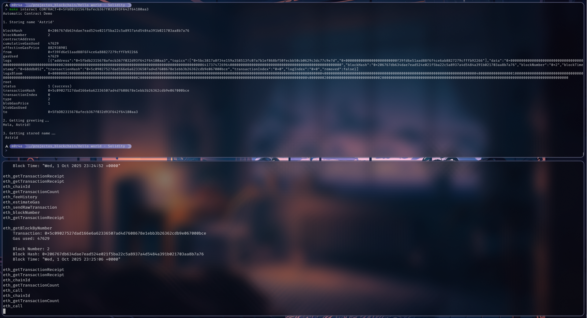

# Greeting Contract - Foundry

Smart contract en Solidity con Foundry que almacena nombres en un mapping y los saluda usando modifiers.

## Requisitos

- Foundry (forge, cast, anvil)

## Instalación de Foundry

```bash
# Opción 1: Desde AUR (Arch Linux)
yay -S foundry-bin

# Opción 2: Instalador oficial
curl -L https://foundry.paradigm.xyz | bash
foundryup
```

Verifica:
```bash
forge --version
```

## Estructura relevante

```
├── Makefile
├── README.md
└── greet-contract/
    ├── src/
    │   └── greetingContract.sol
    ├── test/
    │   └── GreetingContract.t.sol
    ├── script/
    └── foundry.toml
```

## Comandos Make

```bash
make              # Compilar (default)
make help         # Ver todos los comandos
make build        # Compilar contracts
make test         # Ejecutar tests
make test-v       # Tests con output verbose
make gas          # Tests con reporte de gas
make clean        # Limpiar artifacts
make fmt          # Formatear código Solidity
make setup        # Instalar forge-std
make deploy       # Deploy a nodo local
make interact     # Demo interactivo
```

## Workflow Completo

### 1. Compilar y testear

```bash
make build
make test
```

Para tests más detallados:
```bash
make test-v
make gas
```

### 2. Deploy Local

1. Levanta un nodo local

**En una terminal secundaria**

```bash
anvil
```

Esto inicia un nodo de desarrollo en `http://127.0.0.1:8545` con 10 cuentas precargadas.

2. Haz el deploy del contrato

**En tu terminal principal**
```bash
make deploy
```

3. Guarda la dirección "Deployed to" que aparece en el output y en `greet-contract/deploy.log`.

```
Deploying GreetingContract...
No files changed, compilation skipped
Deployer: 0xf39Fd6e51aad88F6F4ce6aB8827279cffFb92266
-----> Deployed to: 0x5FbDB2315678afecb367f032d93F642f64180aa3 <-----
Transaction hash: 0x44ea95ed3377f106fde8d0f24e328657e8c7dea81f134c72cde4ab1ec27c2ae0
Check greet-contract/deploy.log for contract address
```

### 3. Demo automático

```bash
export CONTRACT=0x5FbDB2315678afecb367f032d93F642f64180aa3
make interact CONTRACT=$CONTRACT
```

Esto ejecuta automáticamente:
1. Guarda el nombre "Astrid"
2. Obtiene el saludo
3. Muestra el nombre almacenado

#### Muesta de cómo se vería

<p align="center">
    
</p>

### 4. Interactuar manualmente

**Exportar la dirección del contrato:**
```bash
export CONTRACT=0x5FbDB2315678afecb367f032d93F642f64180aa3
```

#### 1. Guardar un nombre

```bash
cast send $CONTRACT "storeName(string)" "Astrid" \
  --private-key 0xac0974bec39a17e36ba4a6b4d238ff944bacb478cbed5efcae784d7bf4f2ff80 \
  --rpc-url http://127.0.0.1:8545
```

#### 2. Obtener el saludo

```bash
cast call $CONTRACT "greetMe()" \
  --from 0xf39Fd6e51aad88F6F4ce6aB8827279cffFb92266 \
  --rpc-url http://127.0.0.1:8545 | \
  cast --to-ascii
```

Output: `Hola, Astrid!`

#### 3. Ver nombre almacenado

```bash
cast call $CONTRACT "getName(address)" 0xf39Fd6e51aad88F6F4ce6aB8827279cffFb92266 \
  --rpc-url http://127.0.0.1:8545 | cast --to-ascii
```

#### 4. Saludar a otra dirección

```bash
cast call $CONTRACT "greetAddress(address)" 0xf39Fd6e51aad88F6F4ce6aB8827279cffFb92266 \
  --rpc-url http://127.0.0.1:8545 | cast --to-ascii
```

#### 5. Ver el owner del contrato

```bash
cast call $CONTRACT "owner()" \
  --rpc-url http://127.0.0.1:8545
```

#### 6. Borrar tu nombre

```bash
cast send $CONTRACT "deleteMyName()" \
  --private-key 0xac0974bec39a17e36ba4a6b4d238ff944bacb478cbed5efcae784d7bf4f2ff80 \
  --rpc-url http://127.0.0.1:8545
```

#### 7. Reset de emergencia (solo owner)

```bash
cast send $CONTRACT "emergencyReset(address)" 0xf39Fd6e51aad88F6F4ce6aB8827279cffFb92266 \
  --private-key 0xac0974bec39a17e36ba4a6b4d238ff944bacb478cbed5efcae784d7bf4f2ff80 \
  --rpc-url http://127.0.0.1:8545
```

## Características del Contrato

**Modifiers:**
- `onlyOwner`: Solo el dueño puede ejecutar funciones protegidas
- `hasName`: Verifica que el usuario tenga un nombre almacenado

**Funciones principales:**
- `storeName(string)`: Almacena nombre en el mapping
- `greetMe()`: Retorna saludo personalizado
- `greetAddress(address)`: Saluda a cualquier dirección
- `getName(address)`: Consulta nombre almacenado
- `deleteMyName()`: Elimina tu nombre
- `emergencyReset(address)`: Solo owner, elimina nombre de otros

**Events:**
- `NameStored`: Se emite cuando se guarda un nombre
- `NameGreeted`: Se emite cuando se saluda (no implementado actualmente)

## Tests

Los tests cubren:
- Owner correcto al deploy
- Almacenar y actualizar nombres
- Events emitidos correctamente
- Validación de nombres vacíos
- Funciones de saludo
- Modifiers (`onlyOwner`, `hasName`)
- Borrar nombres
- Emergency reset
- Múltiples usuarios simultáneos

```bash
# Ejecutar todos los tests
make test

# Tests con logs detallados
make test-v

# Ver gas usage
make gas
```

## Cuentas de Desarrollo (Anvil)

La primera cuenta que Anvil genera:
- Address: `0xf39Fd6e51aad88F6F4ce6aB8827279cffFb92266`
- Private Key: `0xac0974bec39a17e36ba4a6b4d238ff944bacb478cbed5efcae784d7bf4f2ff80`

> [!CAUTION]
> Estas llaves son públicas y solo para desarrollo local. **NUNCA** usar en producción.

## Comandos Útiles

```bash
forge build          # Compilar
forge clean          # Limpiar artifacts
forge test           # Ejecutar tests
forge fmt            # Formatear código
anvil                # Nodo local de desarrollo
cast send            # Enviar transacción (escribe estado)
cast call            # Llamada de solo lectura
cast --to-ascii      # Decodificar string de hex
```

## Troubleshooting

**Error: "Name not stored"**
- Asegúrate de llamar `storeName()` primero
- Usa `--from` en las llamadas de lectura para especificar la dirección

**Error: "Dry run enabled"**
- Agrega `--broadcast` al comando `forge create`
- El Makefile ya incluye este flag

**Error: "Only owner can call this function"**
- Solo el owner puede ejecutar `emergencyReset()`
- El owner es quien deployó el contrato

**Tests fallan**
```bash
make clean
make build
make test
```

## Deploy a Testnet ESTO ES A MODO DE POC, **NO HACER**

```bash
# Ejemplo: Sepolia testnet
cd greet-contract
forge create src/greetingContract.sol:GreetingContract \
  --rpc-url https://sepolia.infura.io/v3/YOUR_INFURA_KEY \
  --private-key YOUR_PRIVATE_KEY \
  --broadcast
```

> [!CAUTION]
> NO HACER DE VERDAD, no sé si esto está bien hecho y es seguro

## Recursos

- [Foundry Book](https://book.getfoundry.sh/)
- [Solidity Docs](https://docs.soliditylang.org/)
- [Cast Reference](https://book.getfoundry.sh/reference/cast/)
